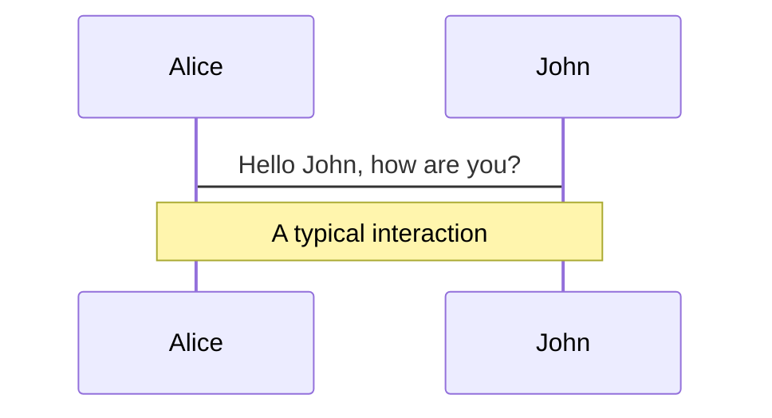
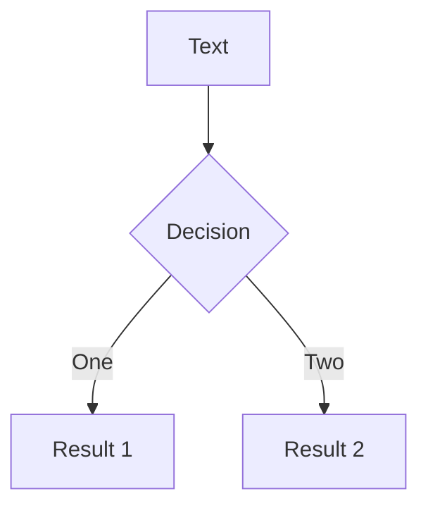
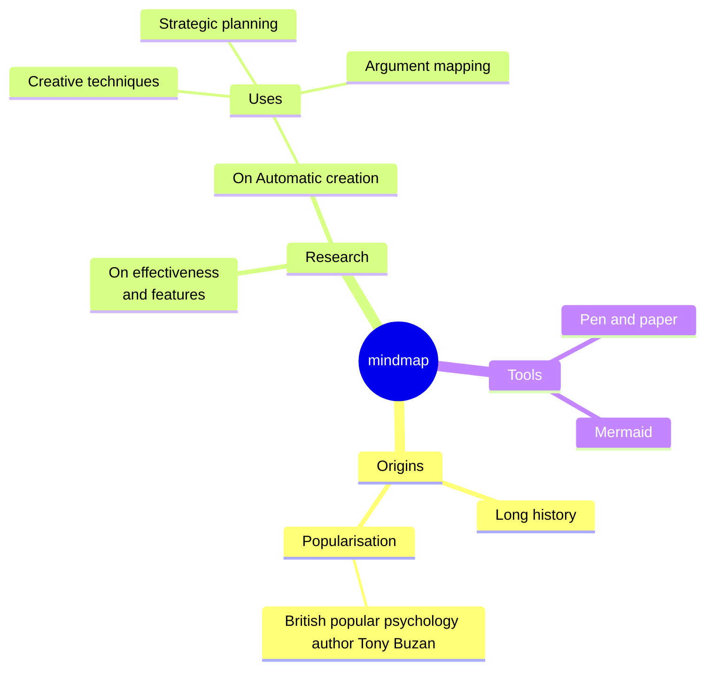
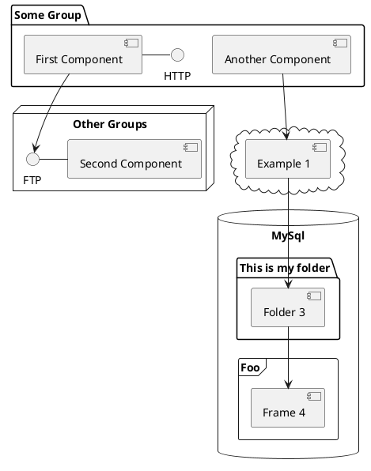

---
# You can also start simply with 'default'
theme: academic
addons:
  - slidev-addon-ichec
# random image from a curated Unsplash collection by Anthony
# like them? see https://unsplash.com/collections/94734566/slidev
background: https://cdn.jsdelivr.net/gh/slidevjs/slidev-covers@main/static/3GmudSL84n4.webp

# some information about your slides (markdown enabled)
title: ICHEC Slidev Showcase, A visual guide to building presentations.
info: |
  ## Slidev Starter Template 
  Presentation slides for developers.

  Learn more at [Sli.dev](https://sli.dev)
# apply unocss classes to the current slide
class: text-center
# https://sli.dev/features/drawing
drawings:
  persist: false
# slide transition: https://sli.dev/guide/animations.html#slide-transitions
transition: slide-left
# enable MDC Syntax: https://sli.dev/features/mdc
mdc: true
# open graph
# seoMeta:
#  ogImage: https://cover.sli.dev
---

# ICHEC Slidev Showcase
## A visual guide to building presentations.

[Rajarshi Tiwari](https://github.com/rajarshitiwari)

Version {{ SLIDE_VERSION }}

<div class="abs-br m-6 text-xl">
  <a href="https://github.com/rajarshitiwari" target="_blank" class="slidev-icon-btn">
    <carbon:logo-github />
  </a>
</div>

<!--
The last comment block of each slide will be treated as slide notes. It will be visible and editable in Presenter Mode along with the slide. [Read more in the docs](https://sli.dev/guide/syntax.html#notes)
-->

---
layout: two-cols
layoutClass: gap-16
---

# Table of contents

You can use the `Toc` component to generate a table of contents for your slides:

```html
<Toc minDepth="1" maxDepth="2" />
```

The title will be inferred from your slide content, or you can override it with `title` and `level` in your frontmatter.

::right::

<Toc text-sm minDepth="1" maxDepth="2" />


---
transition: fade-out
---

# What is Slidev?

Slidev is a slides maker and presenter designed for developers, consist of the following features

- 📝 **Text-based** - focus on the content with Markdown, and then style them later
- 🎨 **Themable** - themes can be shared and re-used as npm packages
- 🧑‍💻 **Developer Friendly** - code highlighting, live coding with autocompletion
- 🤹 **Interactive** - embed Vue components to enhance your expressions
- 🎥 **Recording** - built-in recording and camera view
- 📤 **Portable** - export to PDF, PPTX, PNGs, or even a hostable SPA
- 🛠 **Hackable** - virtually anything that's possible on a webpage is possible in Slidev

~
<br>

~

Read more about [Why Slidev?](https://sli.dev/guide/why)

<!--
You can have `style` tag in markdown to override the style for the current page.
Learn more: https://sli.dev/features/slide-scope-style
-->

<style>
h1 {
  background-color: #2B90B6;
  background-image: linear-gradient(45deg, #4EC5D4 10%, #146b8c 20%);
  background-size: 100%;
  -webkit-background-clip: text;
  -moz-background-clip: text;
  -webkit-text-fill-color: transparent;
  -moz-text-fill-color: transparent;
}
</style>

<!--
Here is another comment.
-->


---
layout: default
---

# ICHEC Component Library
A visual guide to building presentations.


- This is `default` layout, Used as follows:

<br>

```yaml
---
layout: default
---
```

- There are several built-in layouts, and a `dense` layout in the layouts folder of the repository. 
- Following is the list of available layouts -

<FancyTable>

|                 |               |             |              |        |            |
|---------------- |---------------|-------------|--------------|--------|------------|
|404              |center         | cover       | default      | end    | error      |      
|fact             |full           | iframe-left | iframe-right | iframe | image-left |      
|image-right      |image          | intro       | none         | quote  | section    |      
|statement        |two-cols-header| two-cols    | figure-side  | figure | index      |
|table-of-contents|dense          |             |              |        |            |

</FancyTable>

---
layout: default
---

# Banner
- Use banners to draw attention to warnings, tips, or success messages.
- They can also be used for other purposes.

<div class="grid grid-cols-2 gap-8 mt-8">
<div>

**Markdown Code**

```html
<Banner type="warning" title="Note" v-click>

Always remember the **blank lines**
inside custom components!

</Banner>

<Banner type="success" title="Success"
 icon="i-mdi-check" v-click>

Job successfully submitted to the queue.

</Banner>
```
</div>

<div>

**Rendered Output**
<Banner type="warning" title="Note" v-click>

Always remember the **blank lines** inside custom components!

</Banner>

<Banner type="success" title="Success"
 icon="i-mdi-check" v-click>

Job successfully submitted to the queue.

</Banner>

</div>
</div>

---
layout: default
---

# Animated Banner
Great for revealing quiz questions or key takeaways dynamically.

<div class="grid grid-cols-2 gap-8 mt-8">
<div>

**Markdown Code**
```html
<AnimatedBanner title="Question" speed="30" v-click>

This is plain text, **Bold text**,
_italic text_ being typed.

</AnimatedBanner>

<AnimatedBanner title="Question" speed="30" v-click>

- Doesn't it look better to see it being typed?

- It may not necessarily work.

</AnimatedBanner>
```
</div>

<div>

**Rendered Output**

<AnimatedBanner title="Question" speed="30" v-click>

This is plain text, **Bold text**, _italic text_ being typed.

</AnimatedBanner>
<AnimatedBanner title="Question" speed="30" v-click>

- Doesn't it look better to see it being typed?

- It may not necessarily work.

</AnimatedBanner>
</div>
</div>

---
layout: default
---

# Text Formatting
- Use Inline components to make specific text stand out without breaking the flow.
- See what **doesn't** work?

<div class="grid grid-cols-2 gap-8 mt-8">
<div>

**Markdown Code**
```html
Welcome to the <Gt from="blue" to="green">Future</Gt>.

Here is a standard paragraph with a 
<TextBox color="yellow" shadow="true">Highlight</TextBox> 
dropped right in the middle of it.

<br>

Let's see how a list works with
 <Gt from="blue" to="red">Gradient Text (Gt)</Gt>
- <Gt from="blue" to="yellow">First</Gt> item
- <Gt from="blue" to="yellow">Second</Gt> item
Welcome to the <Gt from="blue" to="yellow">future of $x^2$</Gt> computing!

<Gt from="blue" to="yellow" block="true">

Some math:
$$I = \int_0^{\infty} \exp(-x^2)$$

</Gt>
```
</div>

<div>

**Rendered Output**

Welcome to the <Gt from="blue" to="green">Future</Gt>.

Here is a standard paragraph with a <TextBox color="yellow" shadow="true">Highlight</TextBox> dropped right in the middle of it.

Let's see how a list works with <Gt from="blue" to="red">Gradient Text (Gt)</Gt>
- <Gt from="blue" to="yellow">First</Gt> item
- <Gt from="blue" to="yellow">Second</Gt> item

Welcome to the <Gt from="blue" to="yellow">future of $x^2$</Gt> computing!

<Gt from="blue" to="yellow" block="true">

Some math:
$$I = \int_0^{\infty} \exp(-x^2)$$

</Gt>

</div>
</div>

---
layout: default
---

# V-CLICKS

<div class="grid grid-cols-2 gap-8 mt-8">

<div>

**Markdown Code**
```html
<v-clicks>

- In slidev the slides advance in units of clicks.
- By default we have one click per slide.
- Adding `v-click` attribute to components,
or standalone adds a step in transition.
- Do you see it? You can use `v-clicks`
for automated clicks in list like objects.

</v-clicks>
```

</div>

<div>

**Rendered Output**
<v-clicks>

- In slidev the slides advance in units of clicks.
- By default we have one click per slide.
- Adding `v-click` attribute to components, 
or standalone adds a step in transition.
- Do you see it? You can use `v-clicks`
for automated clicks in list like objects.

</v-clicks>
</div>

</div>

---
layout: default
---

# Code Window
Wraps your standard markdown code blocks in a beautiful macOS-style window.

<div class="grid grid-cols-2 gap-8 mt-8">
<div>

**Markdown Code**
````html
<CodeWindow title="my_program.py" width="full">

```python {1|2-4|5-6|7}
import qse
qsqr = qse.lattices.square(lattice_spacing=2.0,
  repeats_x=4, repeats_y=4)
calc = qse.calc.Pulser(**params)
calc.qbits = qsqr
calc.build_sequence()
calc.calculate()
```

</CodeWindow>
<CodeWindow title="submit.sh" width="full">

```bash {1-3|4|*}
#!/bin/bash
#SBATCH -N 1
#SBATCH -p compute
srun python ./my_program.py
```

</CodeWindow>
````
</div>
<div>

**Rendered Output**

<CodeWindow title="my_program.py" width="full">

```python {1|2-4|5-6|7}
import qse
qsqr = qse.lattices.square(lattice_spacing=2.0,
  repeats_x=4, repeats_y=4)
calc = qse.calc.Pulser(**params)
calc.qbits = qsqr
calc.build_sequence()
calc.calculate()
```

</CodeWindow>

<CodeWindow title="submit.sh" width="full">

```bash {1-3|4|*}
#!/bin/bash
#SBATCH -N 1
#SBATCH -p compute
srun python ./my_program.py
```

</CodeWindow>
</div>
</div>

---
layout: default
---

# Fancy Table
Allows you to style standard markdown tables with suitable colors.

<div class="grid grid-cols-2 gap-8 mt-8">
<div>

**Markdown Code**
```html
<FancyTable color="blue" direction="horizontal">

| Node | Cores | RAM  |
|------|-------|------|
| A1   | 64    | 256G |
| A2   | 128   | 512G |

</FancyTable>

<br>

<FancyTable color="green" direction="vertical">

| Node | Cores | RAM  |
|------|-------|------|
| A1   | 64    | 256G |
| A2   | 128   | 512G |

</FancyTable>
```
</div>
<div>

**Rendered Output**
<FancyTable color="blue" direction="horizontal">

| Node | Cores | RAM  |
|------|-------|------|
| A1   | 64    | 256G |
| A2   | 128   | 512G |

</FancyTable>

<br>

<FancyTable color="green" direction="vertical">

| Node | Cores | RAM  |
|------|-------|------|
| A1   | 64    | 256G |
| A2   | 128   | 512G |

</FancyTable>
</div>
</div>

---
layout: default
---

# Grid Layout
The Grid component allows you to easily arrange content into columns without writing complex CSS.

<Grid cols="3" gap="4" class="mt-8">

<Box class="bg-blue-100 p-4 rounded-md">

### Column 1
Perfect for side-by-side images.

</Box>

<Box class="bg-blue-100 p-4 rounded-md">

### Column 2
Or comparing different datasets.

</Box>

<Box class="bg-blue-100 p-4 rounded-md">

### Column 3
Or listing distinct bullet points.

</Box>

</Grid>

**Markdown Code:**
```html
<Grid cols="3" gap="4">
  <Box>...</Box>
  <Box>...</Box>
  <Box>...</Box>
</Grid>
```


---
layout: center
lines: true
---

# Python code

```python {1|2-3|5|6-8|9|all}
# import stuff
import numpy as np
import matplotlib.pyplot as plt

N = 100
x = np.(0, 2 * np.pi, N)
y = np.sin(x)
y *= y
plt.plot(x, y, '.-')

```

---

# Components

- You can use Vue components directly inside your slides.
- Slidev provides a few built-in components like `<Tweet/>` and `<Youtube/>` that you can use directly.
- Adding your custom components is also super easy.

<div grid="~ cols-2 gap-4">

<div>

**Markdown Code**
```html
<Youtube id="RQWpF2Gb-gU" />

<br>

<Counter :count="10" />
```
</div>

<div>

**Rendered Output**

<Youtube id="RQWpF2Gb-gU" />

<!-- ./components/Counter.vue -->
<Counter :count="10" m="t-4" />

Check out [the guides](https://sli.dev/builtin/components.html) for more.
</div>
</div>


---

# Motions

- Motion animations are powered by [@vueuse/motion](https://motion.vueuse.org/), triggered by `v-motion` directive.
- This requires a bit of getting used to, but gives you complete freedom in defining transitions/animations.

```html
<div
  v-motion
  :initial="{ x: -80 }"
  :enter="{ x: 0 }"
  :click-3="{ x: 80 }"
  :leave="{ x: 1000 }"
>
  Slidev
</div>
```

<div class="w-60 relative">
  <div class="relative w-40 h-40">
    
    
    
  </div>

  <div
    class="text-5xl absolute top-14 left-40 text-[#2B90B6] -z-1"
    v-motion
    :initial="{ x: -80, opacity: 0}"
    :enter="{ x: 0, opacity: 1, transition: { delay: 2000, duration: 1000 } }">
    Slidev
  </div>
</div>

<!-- vue script setup scripts can be directly used in markdown, and will only affects current page -->
<script setup lang="ts">
const final = {
  x: 0,
  y: 0,
  rotate: 0,
  scale: 1,
  transition: {
    type: 'spring',
    damping: 10,
    stiffness: 20,
    mass: 2
  }
}
</script>

<div
  v-motion
  :initial="{ x:35, y: 30, opacity: 0}"
  :enter="{ y: 0, opacity: 1, transition: { delay: 3500 } }">

[Learn more](https://sli.dev/guide/animations.html#motion)

</div>

---

# LaTeX

LaTeX is supported out-of-box. Powered by [KaTeX](https://katex.org/).

<div h-3 />

Inline $\sqrt{3x-1}+(1+x)^2$

Block
$$ {1|3|all}
\begin{aligned}
\nabla \cdot \vec{E} &= \frac{\rho}{\varepsilon_0} \\
\nabla \cdot \vec{B} &= 0 \\
\nabla \times \vec{E} &= -\frac{\partial\vec{B}}{\partial t} \\
\nabla \times \vec{B} &= \mu_0\vec{J} + \mu_0\varepsilon_0\frac{\partial\vec{E}}{\partial t}
\end{aligned}
$$

[Learn more](https://sli.dev/features/latex)

---

# Diagrams

You can create diagrams / graphs from textual descriptions, directly in your Markdown.

<div class="grid grid-cols-4 gap-5 pt-4 -mb-6">









</div>

Learn more: [Mermaid Diagrams](https://sli.dev/features/mermaid) and [PlantUML Diagrams](https://sli.dev/features/plantuml)

---
foo: bar
dragPos:
  square: 0,-103,0,0
---

# Draggable Elements

Double-click on the draggable elements to edit their positions.

<br>

###### Directive Usage

```md

```

<br>

###### Component Usage

```md
<v-drag text-3xl>
  <div class="i-carbon:arrow-up" />
  Use the `v-drag` component to have a draggable container!
</v-drag>
```

<v-drag pos="51,163,726,_,-7">
  <div text-center text-3xl border border-main rounded>
    Double-click me!
  </div>
</v-drag>


###### Draggable Arrow

```md
<v-drag-arrow two-way />
```

<v-drag-arrow pos="792,446,-5,-231" two-way op70 />

---
src: ./pages/imported-slides.md
hide: false
---

---

# Monaco Editor

Slidev provides built-in Monaco Editor support.

Add `{monaco}` to the code block to turn it into an editor:

```ts {monaco}
import { ref } from 'vue'
import { emptyArray } from './external'

const arr = ref(emptyArray(10))
```

Use `{monaco-run}` to create an editor that can execute the code directly in the slide:

```ts {monaco-run}
import { version } from 'vue'
import { emptyArray, sayHello } from './external'

sayHello()
console.log(`vue ${version}`)
console.log(emptyArray<number>(10).reduce(fib => [...fib, fib.at(-1)! + fib.at(-2)!], [1, 1]))
```

---
layout: center
class: text-center
---

# Learn More

[Documentation](https://sli.dev) · [GitHub](https://github.com/slidevjs/slidev) · [Showcases](https://sli.dev/resources/showcases)

<PoweredBySlidev mt-10 />

